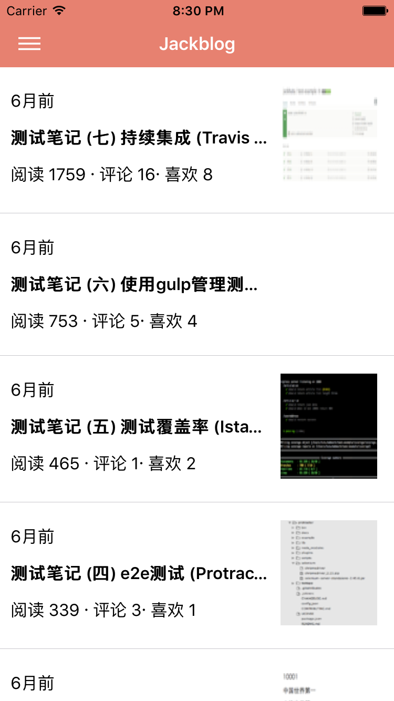
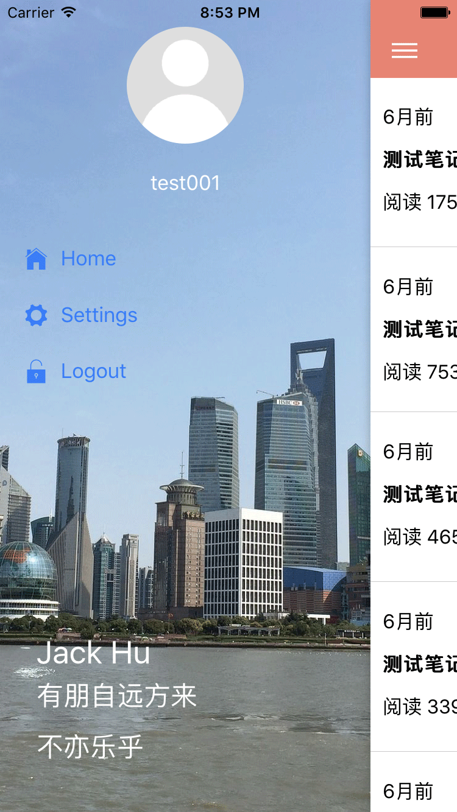
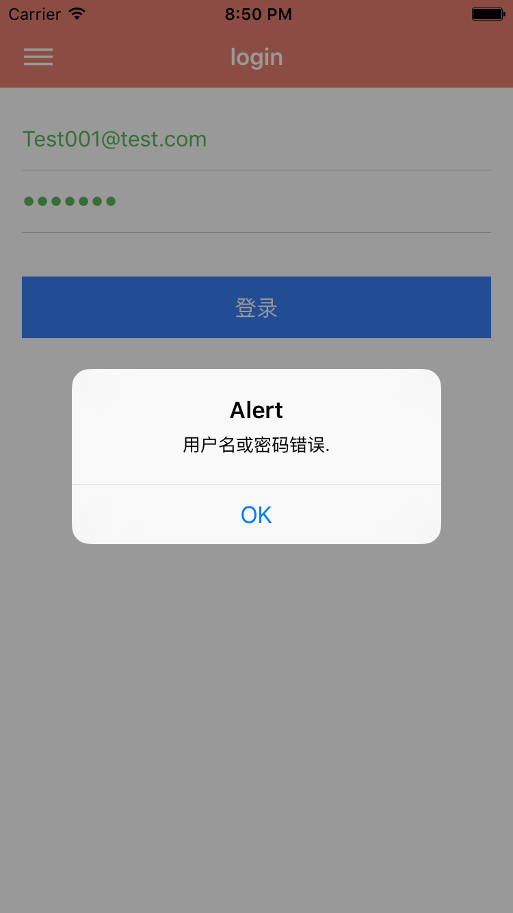
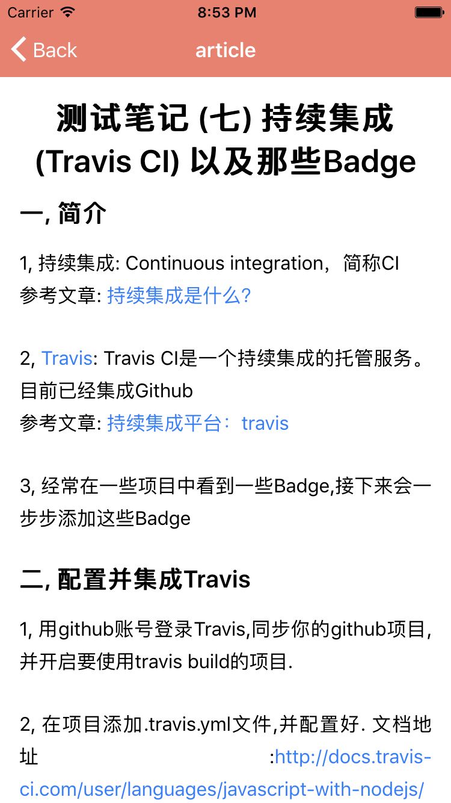

# Jackblog App ionic2.0 版   
[](http://upload.jackhu.top/downloads/Jackblog-ionic2-1.0.0.apk)  

Jackblog 是使用 Node.js + MongoDB + 其它客户端框架开发的个人博客系统,前后端分离,仿简书模板.    
服务端有: [express 版](https://github.com/jackhutu/jackblog-api-express) , [koa 版](https://github.com/jackhutu/jackblog-api-koa)         
客户端有: [angular1.x 版](https://github.com/jackhutu/jackblog-angular1) , [angular2.x 版](https://github.com/jackhutu/jackblog-angular2) , [react redux 版](https://github.com/jackhutu/jackblog-react-redux) , [vue 版](https://github.com/jackhutu/jackblog-vue)    
移动端有: [react native 版](https://github.com/jackhutu/jackblog-react-native-redux), [ionic2.0 版](https://github.com/jackhutu/jackblog-ionic2)    

> API可参考服务端koa版  
> 试用账号: test001@test.com 密码: test001  
> 支持平台 IOS 7+, Android 4.4.4+  

### 开发

```
$ npm install -g ionic@beta
$ git clone git@github.com:jackhutu/jackblog-ionic2
$ cd jackblog-ionic2
$ npm install
$ ionic platform add ios
$ ionic platform add android
```

##### 浏览器调试
```
$ ionic serve
```
> http://localhost:8100/?ionicplatform=android 调试android样式, 默认是ios样式

##### 模拟器或者真机调试
```
$ ionic emulate ios || ionic emulate ios -lc || ionic run ios
$ ionic emulate android || ionic run android
```

### 打包  
 
```
$ ionic build || ionic build ios || ionic build android
```

### 生成apk文件
[http://ionicframework.com/docs/guide/publishing.html](http://ionicframework.com/docs/guide/publishing.html)


### App 预览







### 目录结构

```
.
├── README.md           
├── app                      // 生产目录
│   ├── models               // 数据结构文件
│   ├── pages                // 组件
│   ├── providers            // 可注入的service
│   ├── theme           		 // 主要scss样式文件
│   ├── utils             	 // 工具函数
│   └── config.ts            // api url配置文件
│   └── app.html           	 // app模板文件
│   └── app.ts               // 项目入口文件
├── declare                  // ts项目cordova插件自定义声明文件
├── hooks                    // cordova hooks文件
├── platforms                // cordova 生成各平台文件
├── plugins               	 // cordova 插件目录
├── resources                // icon, splash图片, 可使用ionic生成各种尺寸
├── typings            			 // ts声明文件
├── www                			 // 项目build文件存放目录
├── config.xml               // cordova 配置文件
├── tsconfig.json            // typescript 配置文件
├── typings.json             // typings 安装文件列表
.
```

### ionic2使用注意事项  
> 环境: ionic2 beta.3, 时间: 2016.4.7 

一, 初始化ts 项目方法
```
$ ionic start projectName --v2 --ts
```
二. 需要升级部分依赖包,否则会有警告.  
``` 
angular2.beta6升级到beta7,  
rxjs升级到5.0.0-beta.2,  
zone.js升级到0.5.14  
```
三. ts项目安装cordova plugins之后还需要使用typings安装相应的声明文件.  
目前只有部分插件, 地址[https://github.com/DefinitelyTyped/DefinitelyTyped/tree/master/cordova/plugins](https://github.com/DefinitelyTyped/DefinitelyTyped/tree/master/cordova/plugins).  
安装方法如下:  
```
$ typings install -SA cordova
$ typings install -SA cordova/plugins/pluginName
```  
四. 目前还如法集成crosswalk
 

### License
MIT